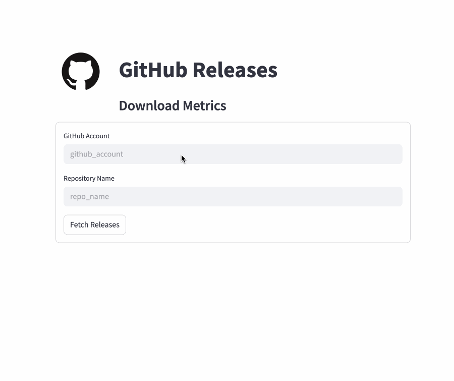

# GitHub Releases Metrics Viewer

This Streamlit app fetches and visualizes GitHub release metrics for any public repository.

Try it live at: [https://gh-release-stats.streamlit.app/](https://gh-release-stats.streamlit.app/)



## 📋 Features

- 🔍 Input any GitHub account and repository
- 📦 Fetches all releases (handles GitHub API pagination)
- 📈 Displays:
  - Total number of downloads
  - Total number of releases
- 📊 Interactive table:
  - Version-wise download counts
  - Sortable, filterable, and color-coded using AgGrid

## 🚀 Getting Started

### 1. Clone this repository or copy the script

### 2. Install dependencies

```bash
pip install streamlit requests pandas
```

### 3. Run the app

```bash
streamlit run fetch_gh_metrics.py
```

## 🛠️ Configuration

When the app starts, enter:
- GitHub account name (e.g. `myAccount`)
- Repository name (e.g. `some_repo`)

Click **Fetch Releases** to retrieve and display data.

## 📌 Notes

- The app uses GitHub’s REST API with pagination (100 items per page).
- Caching is enabled to reduce API calls (`ttl=300` seconds).
- Supports only public repositories.

## 📄 License

MIT License
